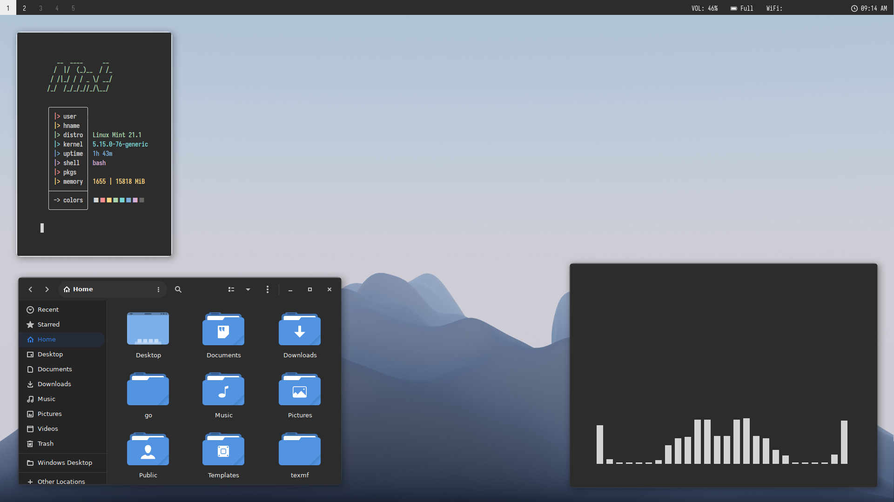

<h2>Preview</h2>

<h2>Overview</h2>
<b>WM:</b> bspwm 
<b>Bar:</b> Eww (edited version of <a href=https://github.com/adi1090x/widgets>Arin</a> by adi1090x) 
<b>GTK Theme:</b> <a href=https://github.com/vinceliuice/Orchis-theme>Orchis Dark</a> (solid version) 
<b>Icons:</b> Tela 
<b>Compositor:</b> picom 
<b>Launcher:</b> rofi 
<b>Font:</b> Iosevka 
<b>File Browser:</b> Nautilus 
<b>Color Scheme:</b> Chalky (Gogh) 

<h2>Helpful Information</h2>
<li>Polybar and bspwm/sxhkd use GNOME and Cinnamon tools and configs</li>
<li>Background color is #2C2C2C for app-specific themes </li>
<li>bspwm turns on tap to click using my specific touchpad ID. See "Essential Configuration" file for more information.</li>
<li>bspwm is configured for a laptop. When connected to an external monitor, bspwm places the laptop screen to the right of the monitor with no workspaces, and puts 5 workspaces on the monitor. </li>
<li>The scratchpad script in .local uses kitty and requires xdotool. Another terminal can used.</li>
<li>Kitty is a bitch to install in Ubuntu/Mint. Build from source for latest version (to use the themes kitten).</li>
