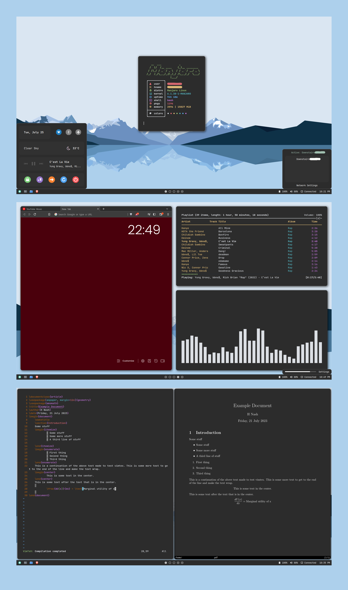

<h2>Preview</h2>

<h2>Overview</h2>
<b>WM:</b> bspwm 
<b>Bar:</b> Eww (edited version of <a href=https://github.com/adi1090x/widgets>Arin</a> by adi1090x) 
<b>GTK Theme:</b> <a href=https://github.com/vinceliuice/Orchis-theme>Orchis Dark</a> (solid version) 
<b>Icons:</b> Tela 
<b>Compositor:</b> picom 
<b>Launcher:</b> rofi 
<b>Font:</b> JetBrains Mono 
<b>File Browser:</b> Nautilus 
<b>Color Scheme:</b> Chalky (Gogh) 

<h2>Before Installing</h2>
<li>Put lock.sh in /usr/bin/</li>
<li>bspwm turns on tap to click using my specific touchpad ID. See "Essential Configuration" file for more information.</li>
<li>The scratchpad script in .local/scripts uses kitty and requires xdotool. Another terminal can used.</li>

<h3>Dependencies</h3>
<b>Packages</b> 
<li>bspwm</li>
<li>sxhkd</li>
<li>rofi</li>
<li>nemo</li>
<li>yshui/picom</li>
<li>kitty (built from source)</li>
<li>mpd/mpc</li>
<li>nmcpcpp</li>
<li>jq</li>
<li>xdo (scratchpad)</li>
<li>i3lock (lock)</li>
<li>scrot (lock)</li>
<li>imagemagick (lock)</li>
<li>rustc (eww)</li>
<li>cargo (eww)</li>
<li>gtk3 (eww)</li>
<li>pango (eww)</li>
<li>gdk-pixbuf2 (eww)</li>
<li>cairo (eww)</li>
<li>glib2 (eww)</li>
<li>gcc-libs (eww)</li>
<li>glibc (eww)</li>
<li>eww</li> 

<b>Fonts</b> 
<li>feather</li>
<li>JetBrains</li>
<li>Iosevka</li>
  
<b>Themes</b> 
<li>Orchis-Dark</li>
  
<b>Icons</b> 
<li>Tela</li>
