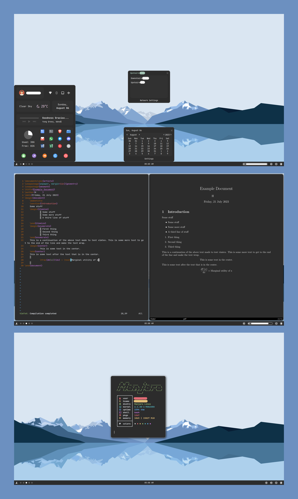

<h2>IMPORTANT: Note on Monitor Control</h2>
 
Monitor control is only hard-coded in .config/polybar/docky/config.ini. The rest is automated for a laptop (eDP*) and HDMI monitor (HDMI*).
 
 
The hard-coded part is the "monitor= _____" part of [bar/laptopbar] and [bar/monitorbar] in .config/polybar/docky/config.ini.
 
 
Note that .config/polybar/launch.sh looks to see if there is a monitor connected. If so, it uses [bar/laptopbar] and [bar/monitorbar]. Otherwise it uses [bar/main]. All three types are defined in .config/polybar/docky/config.ini.
 
 
<h2>Dependencies:</h2>
bspwm/sxhkd 
polybar 
compton 
rofi 
polybar-themes 
i3lock 
imagemagick 
scrot 
wmctrl 
xprop 
slop
 
 
<h2>Other:</h2>
Theme: Graphite https://github.com/vinceliuice/Graphite-gtk-theme 
Icons: Tela-grey-dark 
Font: Iosevka 
File Browser: Thunar 
Color Scheme: Chalky (part of Gogh) 

